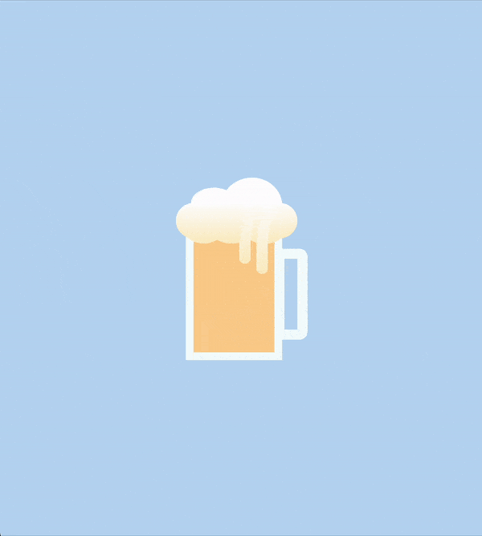

# 🍺 Animated Beer Mug

This project features an animated beer mug with foam and bubbles, showcasing intricate CSS animations and gradients.

## 📦 Technologies

Built with:

- `HTML:` Markup language for creating the structure.
- `CSS:` For styling and animations.

## ⚙️ Getting Started

To view and interact with the animated beer mug:

1. Download the project files.
2. Open the `index.html` file in Visual Studio Code.
3. Use the Live Server extension in VS Code to view the project in your web browser.

## 🖱️ Interaction

Open the project in your browser to see the animated beer mug with moving foam and bubbles.

## 🛣️ Project Structure

Here are the key files and their purposes:

- **index.html**: The main HTML file containing the structure of the animated beer mug.
- **style.css**: The CSS file that styles the beer mug and adds animations.

Feel free to explore and customize these files to suit your needs!

## 📱 Responsive Design

- The animated beer mug is responsive, ensuring a seamless experience on both desktops and mobile devices.

## 🔄 Animations

The beer mug animation includes various CSS animations that create a dynamic and engaging effect. Here’s an overview:

- **Foam Animation**: The foam at the top of the mug expands and drips, adding a realistic touch.
- **Bubble Animation**: Bubbles rise from the bottom of the mug, adding to the animated effect.
- **Gradient Backgrounds**: Gradients are used to give depth and visual interest to the beer and foam.
